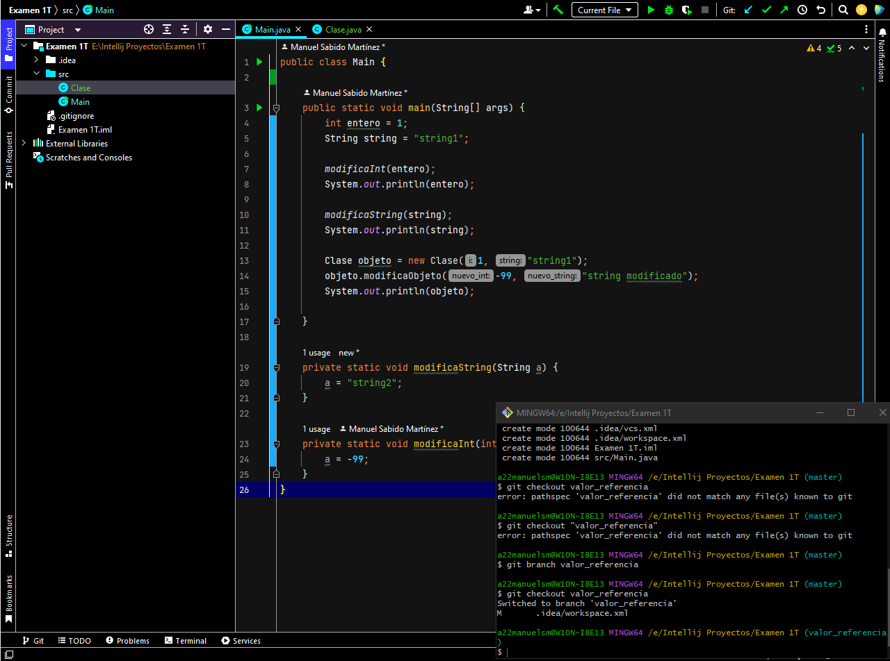
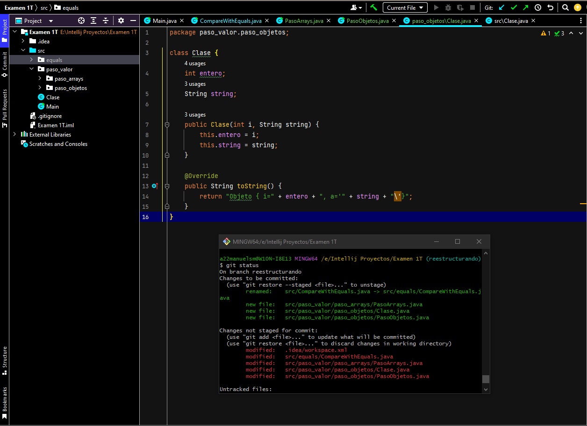

Entornos de Desarrollo - Examen 1T
Nombre completo: (MANUEL SABIDO MARTINEZ)
Grupo: DAM.

1. Creación de un proyecto de IntelliJ con repositorio Git y código de ejemplo.

2. Primer commit en master.

3. Creamos y desarrollamos la rama valor_referencia.

4. Creamos una rama paso_arrays y la desarrollamos.

5. Creamos las ramas comparando_objetos y comparando_strings y las desarrollamos.

6. Creamos la rama "reestructurando" para reorganizar en paquetes. Una vez desarrollada hacemos merge a master (es recomendable ver el estado de los ficheros de este commit, más que el diff). Realizamos una corrección menor en valor_referencia y la hacemos un merge a master.

12. Añadimos el README.md (el de cada uno, en vuestro caso).

13. Todas las ramas deben subirse a GitHub, con master como rama por defecto.